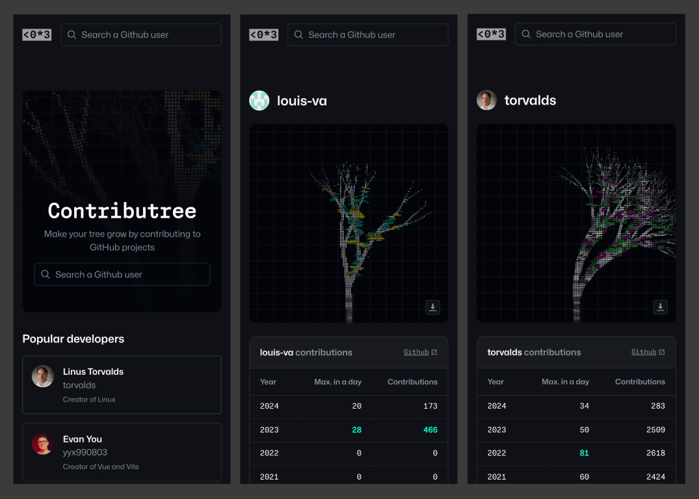

# Contributree

A unique tree representing your Github contributions

[View demo](https://contributree.lou-va.com/)



## About

I built this project to experiment with 2D graphics, procedural generation and the Pixi.js library.
The app fetches a Guthub user's total contributions and build a personalized tree with ASCII characters.

Notable features :
- Procedural generation of a tree based on username + number of contributions
- Download the generated picture as PNG
- Github user search
- Fetching user data from Github API

## Built with

- [React](https://react.dev/)
- [Pixi.js](https://pixijs.com/)
- [Express](https://expressjs.com/)

## Getting Started

### ⚙️ Prerequisites

Ensure you have `Node.js` and `npm` installed on your machine to run this project locally.

### 💾 Installation

#### 1. Clone the Repository
```sh
git clone git@github.com:louis-va/contributree.git
```

#### 2. Install server & client dependencies
```sh
cd server/
npm install

cd client/
npm install
```

#### 3. Add `.env` variables

##### `client/.env`
```ini
VITE_API_URL='' # URL of the server. By default: http://localhost:8000
```

##### `server/.env`
```ini
PORT= # Port the server is listening at. By default 8000
GITHUB_ACCESS_TOKEN='' # Github API Key.
```

### 🚀 Execution

#### Run server & client
```sh
cd server/
npm run dev

cd client/
npm run dev
```

### 🚚 Production

#### Build and Run Client & Server
```sh
cd server/
npm run build
npm run start

cd client/
npm run build
npm run preview
```

#### Docker Compose
Launch the server using Docker Compose on port 8000

```sh
cd server/
docker compose up -d
```

#### Deployment
To deploy the site in production, in `/client/.env.production`, set `VITE_API_URL` as your server URL and `VITE_URL` as your client URL. Additionally, configure the `allowedOrigins` in `/server/index.ts` to allow your client's URL to connect to the server.

### 🌐 Ports
**Client**: http://localhost:3000 <br>
**Server**: http://localhost:8000

You can edit the port values in `/server/.env` and `/client/vite.config.ts`. If you change the client's port, remember to update `allowedOrigins` in `/server/index.ts` with the new port.